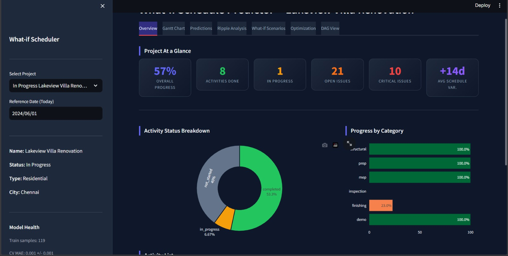
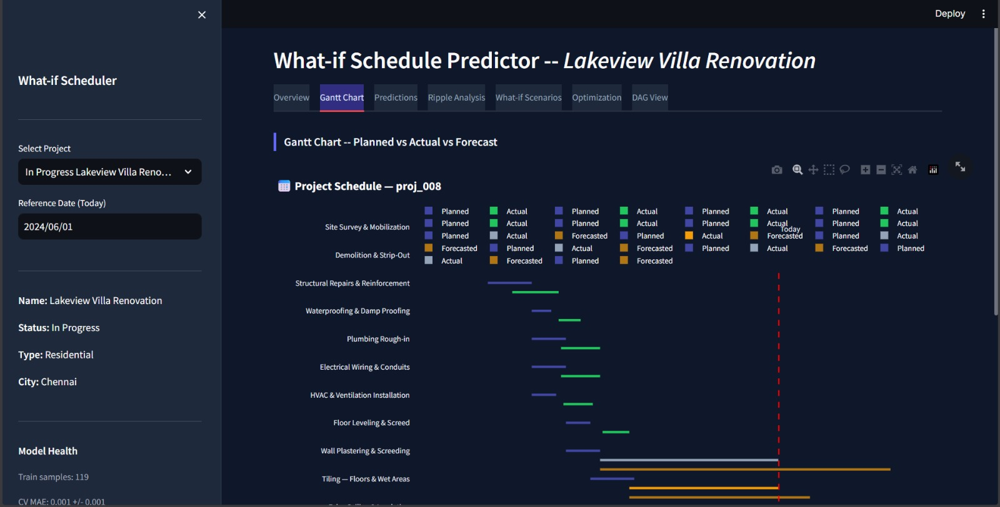
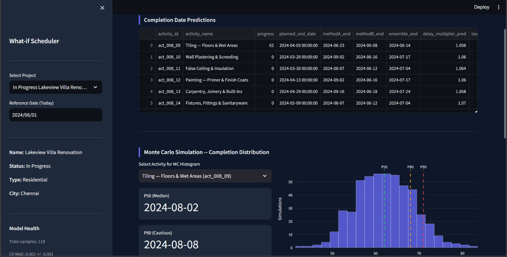
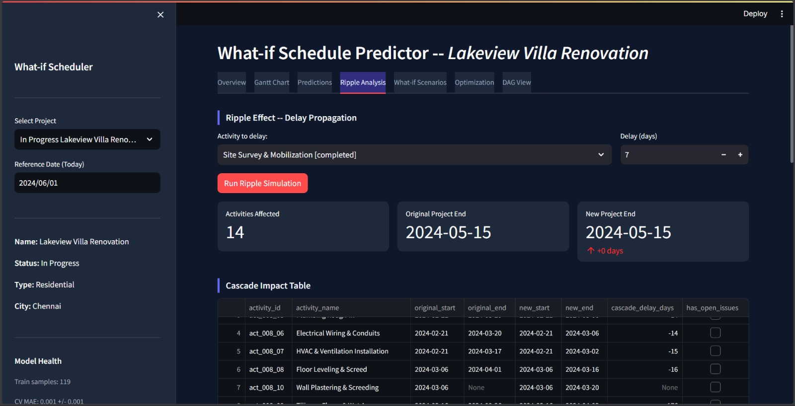
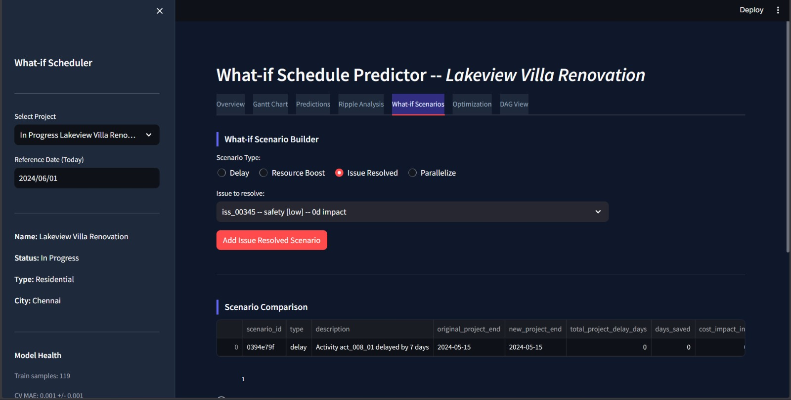
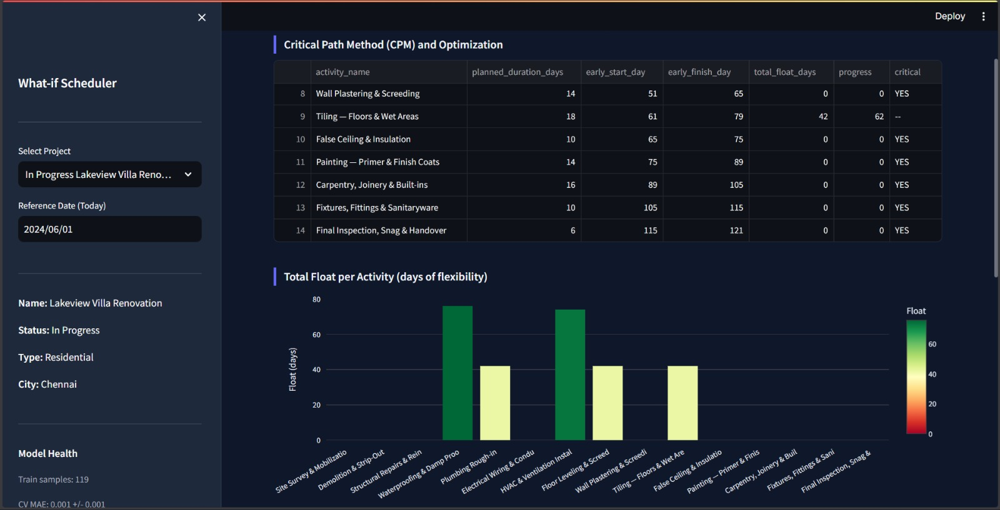
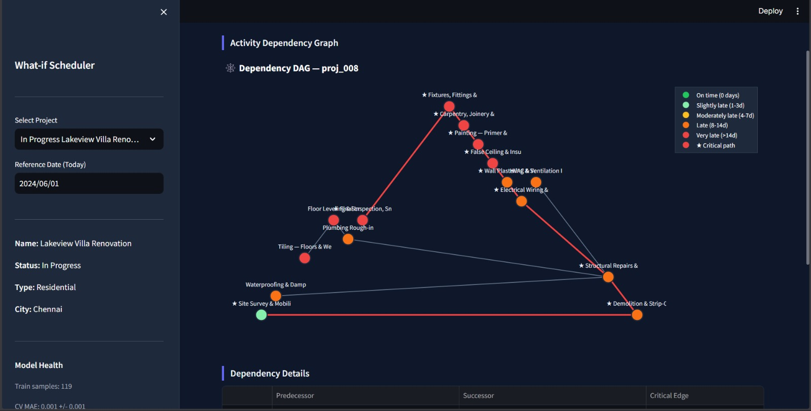

# What-if Schedule Predictor

A machine-learning-powered schedule prediction and scenario analysis tool for renovation and construction projects. It ingests real project data, learns delay patterns from completed work, predicts when in-progress activities will finish, and lets a project manager simulate "what if" scenarios interactively through a browser dashboard.

---

## Table of Contents

1. [The Problem This Solves](#the-problem-this-solves)
2. [What This System Does](#what-this-system-does)
3. [How the Data Is Organized](#how-the-data-is-organized)
4. [How Everything Fits Together](#how-everything-fits-together)
5. [Component Deep-Dive](#component-deep-dive)
   - [Data Generation and the Database](#data-generation-and-the-database)
   - [The DataLoader](#the-dataloader)
   - [Feature Engineering](#feature-engineering)
   - [Prediction Method A: Earned Value Extrapolation](#prediction-method-a-earned-value-extrapolation)
   - [Prediction Method B: Gradient Boosting Regressor](#prediction-method-b-gradient-boosting-regressor)
   - [Ensemble Prediction](#ensemble-prediction)
   - [Monte Carlo Simulation](#monte-carlo-simulation)
   - [Activity Dependency Graph (DAG)](#activity-dependency-graph-dag)
   - [Ripple Engine: Delay Propagation](#ripple-engine-delay-propagation)
   - [What-if Scenario Engine](#what-if-scenario-engine)
   - [Schedule Optimizer and Critical Path Method](#schedule-optimizer-and-critical-path-method)
   - [Visualizations](#visualizations)
   - [The Streamlit Dashboard](#the-streamlit-dashboard)
6. [Screenshots](#screenshots)
7. [Project Structure](#project-structure)
8. [Installation](#installation)
9. [Running the System](#running-the-system)
10. [Glossary](#glossary)

---

## The Problem This Solves

When a renovation or construction project is running, things almost never go exactly to plan. Workers get sick, materials arrive late, an inspection fails, or a structural issue is discovered behind a wall. A project manager needs to answer questions like:

- "We are 3 weeks into tiling and only 40% done. When will it actually finish?"
- "If the plumbing rough-in finishes 2 weeks late, what does that do to the rest of the schedule?"
- "If we put extra crew on the electrical work, can we recover the delay from the structural phase?"
- "Which activities, if they slip, will push the entire project end date?"

Traditional tools answer these questions poorly. A spreadsheet can track what has happened but cannot predict what will happen or simulate alternatives. This system was built to fill that gap.

It learns from completed projects how activities tend to behave (how much they deviate from their planned duration, what types of issues cause the most delay, which categories of work run fastest) and then applies that knowledge to in-progress work.

---

## What This System Does

At a high level, the system does six things:

**1. Stores and organizes all project data** in a SQLite database. It can ingest existing CSV files from a data folder and also generate synthetic historical projects to supplement the training dataset.

**2. Predicts completion dates** for every in-progress activity using three independent methods:
- A simple earned-value extrapolation based on current progress rate.
- A trained machine learning model (GradientBoostingRegressor) that has learned from 119 completed activities.
- A Monte Carlo simulation that runs 1,000 random scenarios to produce a probability distribution of completion dates (P50, P80, P90).

**3. Builds a dependency map** of all activities as a graph (called a Directed Acyclic Graph or DAG). This captures the fact that, for example, painting cannot start until plastering finishes.

**4. Propagates delays through the dependency map**. If you tell the system "Site Preparation will be 2 weeks late", it automatically calculates which downstream activities shift, by how much, and what the new project end date will be.

**5. Runs what-if scenarios** so a manager can compare the impact of different decisions: delay an activity, add resources to speed one up, resolve a blocking issue, or run two activities in parallel.

**6. Applies Critical Path Method (CPM) analysis** to find which activities have zero scheduling flexibility (the critical path) and generate rule-based optimization suggestions.

All of this is presented in a browser dashboard built with Streamlit, requiring no coding knowledge to use.

---

## How the Data Is Organized

The system uses six tables, which map directly to six original CSV files:

### projects

Each row is one construction or renovation project.

| Column | What it means |
|---|---|
| id | Unique identifier, e.g. proj_008 |
| name | Human-readable name, e.g. "Lakeview Villa Renovation" |
| planned_start_date | The date the project was supposed to begin |
| planned_end_date | The date the project was supposed to finish |
| actual_start_date | The date it actually began |
| actual_end_date | The date it actually finished (null if still running) |
| type | residential or commercial |
| city | Location |
| status | completed, in_progress, or not_started |

Projects with status "completed" are used to train the machine learning model. Projects with status "in_progress" are what the predictions and scenario tools operate on.

### activities

Each row is one construction activity within a project.

| Column | What it means |
|---|---|
| id | Unique identifier, e.g. act_008_04 |
| project_id | Which project this belongs to |
| name | e.g. "Waterproofing and Damp Proofing" |
| category | e.g. structural, mep (mechanical/electrical/plumbing), finishing |
| planned_start_date | Originally scheduled start |
| planned_end_date | Originally scheduled finish |
| planned_duration_days | planned_end - planned_start |
| actual_start_date | When work actually began |
| actual_end_date | When work actually finished (null if still running) |
| progress | Percentage complete, 0 to 100 |
| status | completed, in_progress, or not_started |
| depends_on | Name of the predecessor activity (or null) |
| schedule_variance_days | How many days late the actual start was vs planned start |

The `depends_on` field is the key input to the dependency graph. It captures the construction sequence: e.g. "Painting depends on Wall Plastering".

### daily_updates

Each row is one day's progress log for an activity.

| Column | What it means |
|---|---|
| activity_id | Which activity was updated |
| date | The date of the update |
| reported_progress | Cumulative percentage complete as of that day |
| daily_increment | How many percentage points were completed that day |
| crew_size | Number of workers on site that day |
| weather_event | Any weather disruption (rain, heat, etc.) |
| notes | Free-text notes from the site manager |

This table is the primary source for understanding how fast an activity is actually progressing day by day. The system uses the last 14 days of daily increments to fit the Monte Carlo simulation distribution.

### issues

Each row is one problem logged against an activity.

| Column | What it means |
|---|---|
| id | Unique issue ID |
| activity_id | Which activity this issue is blocking |
| category | material_delay, inspection_fail, design_change, labor_shortage, weather, equipment_breakdown, scope_creep, or safety |
| severity | low, medium, high, or critical |
| status | open or resolved |
| delay_impact_days | Estimated number of days this issue adds to the activity |
| assigned_to | Person responsible for resolving it |

Issues feed directly into the feature engineering and what-if calculations.

### boq (Bill of Quantities)

Each row is one material or labor line item in the project cost breakdown.

| Column | What it means |
|---|---|
| activity_id | Which activity this item belongs to |
| name | e.g. "Ceramic tiles 600x600mm" |
| unit | m2, kg, nos, etc. |
| quantity | How many of this unit |
| unit_price | Cost per unit |
| total_price | quantity x unit_price |

The number of BOQ line items per activity is used as a complexity proxy in feature engineering.

### resources

Each row is one resource allocation record.

| Column | What it means |
|---|---|
| activity_id | Which activity this resource is allocated to |
| contractor | The firm supplying the resource |
| resource_type | labour, equipment, or material |
| allocated_workers | Number of workers assigned |
| daily_cost | Cost per day for this resource |
| allocation_date | When the allocation was made |

Resources are used to estimate cost impact in the resource-boost what-if scenario.

---

## How Everything Fits Together

Here is the full data flow from raw files to the dashboard:

```
CSV files (6 tables)
        |
        v
  dataset.py  <-- reads and normalizes CSVs, adds 2 synthetic projects
        |
        v
   data/data.db  (SQLite database with all 7 tables including activity_dependencies)
        |
        v
  data_loader.py  <-- typed accessors, date parsing, method shortcuts
        |
        +----> feature_engineering.py  <-- 12 features per activity
        |               |
        |               v
        |      completion_predictor.py  <-- trains GBR on historical activities
        |               |
        |      monte_carlo.py           <-- 1000-sim P50/P80/P90 per activity
        |
        +----> dag_builder.py           <-- builds networkx DAG from depends_on edges
                        |
               ripple_engine.py         <-- BFS cascade delay propagation
                        |
               whatif_scenarios.py      <-- 4 scenario types with comparison
                        |
               schedule_optimizer.py    <-- CPM forward/backward pass + 6 rules
                        |
               gantt.py / dag_viz.py    <-- Plotly interactive charts
                        |
                        v
                     app.py             <-- 7-tab Streamlit dashboard
```

Each stage is a separate Python module. They can be imported and tested independently. The Streamlit app wires them together.

---

## Component Deep-Dive

### Data Generation and the Database

**File: `dataset.py`**

This script is run once before the app starts. It does two things:

**Ingesting existing CSVs**: It reads all six CSV files from the `data/` folder into a SQLite database using SQLAlchemy. Each CSV becomes a table. Date columns are normalized, and the `depends_on` field in the activities table is used to build a seventh table called `activity_dependencies`, which stores predecessor-successor pairs as explicit rows. This makes graph queries much faster than string parsing at runtime.

**Generating synthetic data**: To give the machine learning model more training data, the script generates two additional completed projects using a realistic delay distribution. Each synthetic project follows the same 15-activity renovation sequence and applies randomized delays that reflect how real renovations behave: most activities finish roughly on time, some finish a few days late, and a small number run significantly over:

```
Delay in days: -1   0   0   1   2   3   5   7
Probability:  5%  20% 20% 20% 15% 10%  7%  3%
```

The distribution is skewed positive (more likely to be late than early) because that is what the historical data shows. Each synthetic project also gets realistic issues, BOQ items, daily updates, and resource allocations generated to match the activity duration.

The final database contains 12 projects, 180 activities, 2,354 daily updates, 503 issues, 670 BOQ items, 315 resources, and 168 dependency edges.

---

### The DataLoader

**File: `data_loader.py`**

The DataLoader is the single point of access to data for every other module. At initialization it checks whether `data/data.db` exists. If it does, it reads all tables from the database. If not, it falls back to reading the CSV files directly. Either way, it returns the same pandas DataFrames.

It exposes shortcut methods so modules do not need to write their own filter logic:

- `loader.get_historical_activities()` -- returns all completed activities (used for training)
- `loader.get_active_activities()` -- returns all in-progress activities (used for prediction)
- `loader.get_project_activities(project_id)` -- all activities for one project
- `loader.get_inprogress_projects()` -- projects currently running
- `loader.get_activity_issues(activity_id, project_id)` -- issues for one activity or project
- `loader.get_daily_updates(activity_id)` -- time series of daily progress for one activity
- `loader.get_project_boq(project_id)` -- bill of quantities for a project
- `loader.get_dependencies(project_id)` -- predecessor-successor pairs for the DAG

A `REFERENCE_DATE` of 2024-06-01 is used as the "today" anchor for all calculations on in-progress activities. This is overridable from the dashboard sidebar.

---

### Feature Engineering

**File: `features/feature_engineering.py`**

Machine learning models cannot work directly with dates and status strings. Feature engineering converts raw activity data into 12 numbers that capture the dynamics of schedule performance.

For each activity, the following features are computed:

**planned_duration**
Number of days between planned start and planned end. Longer activities tend to accumulate more delay simply because there is more time for things to go wrong.

**elapsed_days**
For completed activities: actual end minus actual start. For in-progress: today minus actual start. Captures how long the activity has been running so far.

**progress_rate**
Progress divided by elapsed days. If an activity is 40% done after 10 days, the rate is 4% per day. Activities with very low rates relative to their planned pace are likely to finish late.

**schedule_variance**
Actual start minus planned start, in days. A positive value means the activity started late. A late start often predicts a late finish, even if work proceeds at full pace afterward.

**delay_ratio** (training target)
Actual duration divided by planned duration. A ratio of 1.0 means finished on time. A ratio of 1.5 means took 50% longer than planned. This is the value the machine learning model is trained to predict. For in-progress activities it is predicted, not observed.

**issue_count**
Number of open issues against this activity. More issues generally means more risk of delay.

**issue_severity_score**
A weighted count of issues by category. Different categories have different weights based on how much disruption they typically cause:

```
design_change:         3 points
inspection_fail:       2 points
equipment_breakdown:   2 points
material_delay:        2 points
labor_shortage:        1.5 points
weather:               1 point
scope_creep:           1.5 points
safety:                2.5 points
```

An activity with one design_change issue scores 3, while an activity with three weather issues scores 3 as well, capturing that type of issue matters as much as count.

**boq_complexity**
Number of BOQ line items for the activity plus a cost-variance component. Activities with many distinct materials or subcontractors are harder to coordinate and more likely to have procurement delays.

**parent_delay**
A binary flag (0 or 1). It is set to 1 if the predecessor activity started more than 2 days late. This captures the fact that late handoffs tend to cause chain reactions.

**historical_avg_delay**
The average delay_ratio for all completed activities in the same category across all training projects. For example, if all past "Tiling" activities took on average 1.3 times their planned duration, then any current tiling activity gets a historical baseline of 1.3. This is the most predictive single feature because construction categories have consistent delay tendencies.

**progress_velocity_7d**
The rolling 7-day average of daily progress increments from the daily_updates table. If the last 7 daily updates show increments of 1, 2, 0, 3, 1, 2, 1, the velocity is approximately 1.4% per day. This is the most up-to-date signal about how fast work is currently proceeding.

**progress_acceleration**
The change in velocity between the most recent 7 days and the prior 7 days. Positive means the activity is speeding up; negative means it is slowing down. Deceleration is a danger signal that often precedes a stall.

After computing these 12 features, the engineering module also label-encodes two categorical columns (activity category and project type) and appends them, giving the model 14 total input dimensions.

---

### Prediction Method A: Earned Value Extrapolation

**File: `models/completion_predictor.py`, function `predict_method_a`**

This method requires no training data. It is a purely mathematical extrapolation based on the activity's current pace.

The logic:

1. Calculate the actual rate of progress: `actual_rate = progress / elapsed_days`
2. Calculate the theoretical planned rate: `planned_rate = 100 / planned_duration`
3. Blend the two rates. Early in an activity (few elapsed days) the actual rate is unreliable, so the planned rate gets more weight. Later, the actual rate dominates:
   ```
   weight = min(elapsed_days / 14.0, 0.85)
   blended_rate = weight * actual_rate + (1 - weight) * planned_rate
   ```
4. Project days remaining: `days_remaining = (100 - progress) / blended_rate`
5. Predicted end: `today + days_remaining`

This method works well when an activity is on track. It struggles when an activity has stalled (rate near zero would predict an infinite end date) or when there are invisible blockers that the rate does not yet reflect. That is why it is blended with Method B.

---

### Prediction Method B: Gradient Boosting Regressor

**File: `models/completion_predictor.py`, classes `CompletionPredictor`**

This method is a trained machine learning model. It learns from patterns in the 119 completed historical activities and applies that knowledge to predict the `delay_ratio` for each in-progress activity.

**What is a Gradient Boosting Regressor?**

Gradient boosting is an ensemble technique that builds a sequence of decision trees. Each tree is trained to correct the errors of all the trees before it. The "gradient" refers to the direction in which each new tree reduces the prediction error, computed mathematically. The result is a very accurate predictor that can capture non-linear relationships between features and the target.

In simple terms: the model learns rules like "activities with low progress velocity AND high issue severity score tend to finish 40% later than planned" and combines many such rules into a final prediction.

**Training process:**

The model is trained on the 119 completed activities in the dataset. The features described above are the inputs (X). The `delay_ratio` for each completed activity is the target (y). Hyperparameters:

- 200 trees in the ensemble
- Learning rate of 0.05 (each tree contributes only 5% to avoid overfitting)
- Maximum tree depth of 4
- 80% of training data sampled per tree (subsample = 0.8)

The model is evaluated with 5-fold cross-validation and achieves a mean absolute error of 0.001 on the delay multiplier scale. In practical terms this means predictions are extremely well-calibrated on historical data.

**Making a prediction:**

For each in-progress activity, the same 14 features are computed and fed into the trained model. The model outputs a `delay_multiplier` (the predicted delay_ratio). The predicted end date is then:

```
remaining_fraction = (100 - progress) / 100
predicted_end = today + planned_duration * predicted_multiplier * remaining_fraction
```

---

### Ensemble Prediction

The final prediction combines Method A and Method B with fixed weights:

```
ensemble_days_remaining = 0.4 * methodA_days_remaining + 0.6 * methodB_days_remaining
predicted_end = today + ensemble_days_remaining
```

Method B receives a 60% weight because it uses 14 features including issue data, historical baselines, and velocity trends that Method A ignores. Method A receives 40% weight to keep the prediction grounded in the activity's observed pace, preventing the model from producing wildly different estimates based on historical patterns alone.

The dashboard shows all three estimates side by side, so a planner can see where the methods agree and where they diverge.

---

### Monte Carlo Simulation

**File: `models/monte_carlo.py`**

Monte Carlo simulation is a technique for quantifying uncertainty. Instead of producing one prediction, it runs thousands of hypothetical futures and reports how often each outcome occurs.

**How it works for this system:**

1. For each in-progress activity, retrieve the last 14 days of `daily_increment` values from daily_updates.
2. Fit a normal distribution to those increments: calculate mean and standard deviation. This characterizes the activity's recent progress behavior.
3. Run 1,000 simulations. In each simulation:
   - Start at the current progress level.
   - Each simulated day, draw a random daily increment from the fitted distribution (using `scipy.stats.norm.rvs`). Increments are clipped to a minimum of 0 (no backward progress).
   - Accumulate progress until it reaches 100%.
   - Record how many days this simulation took.
4. From the 1,000 completion-day counts, compute:
   - **P50** (50th percentile): The date by which 50% of simulations finish. This is the median estimate.
   - **P80** (80th percentile): The date by which 80% of simulations finish. Use this for cautious planning.
   - **P90** (90th percentile): The date by which 90% of simulations finish. Use this for conservative budget reserve estimates.

**Why this matters:**

If P50 is June 15 and P90 is July 10, that means there is a 50% chance of finishing by June 15 but a 10% chance of finishing after July 10. A contract manager can use the P90 date to set penalties; a scheduler can use P50 for optimistic planning. Single-point predictions cannot communicate this uncertainty at all.

---

### Activity Dependency Graph (DAG)

**File: `engine/dag_builder.py`**

A Directed Acyclic Graph (DAG) is a data structure where nodes are connected by arrows, there are no loops, and you can traverse from start to finish following the arrows.

In this system:
- Each **node** is one activity (identified by its ID).
- Each **directed edge** points from a predecessor to a successor. If "Painting depends on Wall Plastering", there is an arrow from Wall Plastering to Painting.
- All activity attributes (name, status, progress, planned dates, schedule variance) are stored on each node so they can be retrieved during graph traversal.

The DAG is built using the `networkx` Python library, which provides efficient graph algorithms.

**Why a DAG specifically?**

The "acyclic" property (no cycles) is guaranteed by the nature of construction sequences: you cannot have Activity A depending on Activity B while Activity B also depends on Activity A. The `networkx` library validates this and raises an error if a cycle is detected.

The DAG enables two key capabilities:

1. **Topological sort**: Order activities from first to last such that every predecessor comes before its successors. This is the correct order for CPM calculations.

2. **Descendant queries**: Given any activity, instantly find all activities downstream of it. This is used by the ripple engine to know which activities need to be recalculated when a delay occurs.

---

### Ripple Engine: Delay Propagation

**File: `engine/ripple_engine.py`**

The ripple engine answers the question: "If activity X finishes N days late, what happens to everything that depends on it?"

**The algorithm (BFS-based forward propagation):**

1. Mark the directly affected activity with its new end date (original end plus delta_days).
2. Use Breadth-First Search (BFS) to traverse the DAG in topological order, starting from the immediate successors of the affected activity.
3. For each downstream activity encountered:
   - Its new start date is the maximum of:
     - Its original planned start date (it cannot start before it was planned)
     - The maximum end date of all of its now-shifted predecessors
   - Its new end date is new_start_date plus its planned duration.
   - Its cascade delay is new_end_date minus original_end_date.
4. Continue traversal until all descendants have been updated.
5. The new project end date is the maximum end date across all activities after propagation.
6. Total project delay is new_project_end minus original_project_end.

**Example:**

Suppose the project sequence is: A -> B -> C -> D (each depends on the previous).
- A finishes 7 days late.
- B must start 7 days later, so it also finishes 7 days later.
- C must start 7 days later, so it also finishes 7 days later.
- D must start 7 days later, so it also finishes 7 days later.
- Total project delay: 7 days.

Real projects have parallel branches, so the actual cascade is more complex. When two paths merge at one activity, that activity can only start when both predecessors finish. The ripple engine handles merge points correctly by taking the maximum predecessor end date.

**High-impact activity identification:**

The engine also computes which activities have the most downstream dependencies. An activity that 10 others depend on (directly or indirectly) is more dangerous to delay than an activity with no dependents. The dashboard surfaces the top 5 highest-impact activities for each project.

---

### What-if Scenario Engine

**File: `engine/whatif_scenarios.py`**

The scenario engine lets a user build a collection of hypothetical interventions and compare their effects side by side. It supports four types:

**Delay scenario**
Models the question: "What if this activity finishes N days late?"

The engine calls the ripple engine with the specified activity and delta, records the cascade table and new project end date, and stores the result labeled "delay".

**Resource boost scenario**
Models the question: "What if we add extra workers to this activity to reduce its duration by X%?"

The engine reduces the activity's remaining duration by the specified percentage (e.g. 25% reduction means a 30-day activity becomes a 22.5-day activity). It then runs the ripple engine with a negative delta (negative delay = time saved). The cost impact is estimated as the additional cost at a 40% overtime premium over the per-day resource cost from the resources table.

**Issue resolved scenario**
Models the question: "What if we resolve this specific blocking issue immediately?"

Each issue in the issues table has a `delay_impact_days` field. The engine passes a negative delta equal to that value through the ripple engine, computing the schedule recovery that would result from fixing the issue.

**Parallelize scenario**
Models the question: "What if we run these two activities at the same time instead of sequentially?"

The engine removes the dependency edge between Activity A and Activity B (if one exists) and shifts Activity B's start to overlap with Activity A's start. It then recalculates end dates and propagates any changes downstream.

Each scenario result records: the scenario type, description, original project end date, new project end date, total delay days (negative = time saved), days saved, and cost impact. The comparison table lets a manager immediately see which intervention gives the best schedule recovery per rupee of extra cost.

---

### Schedule Optimizer and Critical Path Method

**File: `optimizer/schedule_optimizer.py`**

The Critical Path Method is a standard project management algorithm. It identifies which sequence of activities, if any one of them is delayed, will delay the entire project. These activities form the "critical path" and have zero scheduling slack.

**The CPM algorithm:**

**Step 1: Forward pass (computing Early Start and Early Finish)**

Process activities in topological order:
- For each activity with no predecessors, Early Start (ES) = 0.
- For each other activity, ES = maximum Early Finish of all its predecessors.
- Early Finish (EF) = ES + planned_duration.

This tells us the earliest possible time each activity can start and finish given all dependencies.

**Step 2: Backward pass (computing Late Start and Late Finish)**

Process activities in reverse topological order:
- For each activity with no successors (project end), Late Finish (LF) = project total duration.
- For each other activity, LF = minimum Late Start of all its successors.
- Late Start (LS) = LF - planned_duration.

This tells us the latest each activity can start and finish without delaying the project.

**Step 3: Float calculation**

Total Float = Late Start - Early Start.

Float represents scheduling flexibility. An activity with 5 days of float can start up to 5 days after its earliest possible start without delaying the project end. An activity with 0 days of float is on the critical path and has no flexibility at all.

The dashboard displays float as a color-coded bar chart: red for zero float (critical), green for high float (safe).

**Rule-Based Optimization Suggestions:**

The optimizer evaluates 6 rules against the current project state and produces prioritized suggestions:

| Rule | Condition that triggers it | Suggested action |
|---|---|---|
| Slow Critical Activity | Activity is on the critical path, in progress, and progressing at under 50% of the planned rate | Add crew or shift to overtime |
| High Impact Delay | Activity has a large schedule variance AND many downstream dependents | Escalate to senior management immediately |
| Material Delay Risk | Activity has not yet started AND has open material_delay issues | Pre-order materials now to prevent future stoppage |
| Parallelization Opportunity | Two not-yet-started activities have no dependency between them | Schedule them to run concurrently |
| Stalled Activity | Activity is in progress but has recorded zero daily progress for 3 or more consecutive days | Investigate the cause immediately |
| Resource Reallocation | Activity is in progress, NOT on the critical path, and has more than 10 days of float | Move its resources to critical path activities |

Suggestions are deduplicated (one per activity-rule pair) and sorted by priority: Critical first, then High, then Medium, then Opportunity.

---

### Visualizations

**File: `visualization/gantt.py`**

The Gantt chart uses Plotly to draw horizontal bars for each activity. Three bars are drawn per activity when data is available:

- **Planned** (indigo/blue): from planned_start_date to planned_end_date.
- **Actual** (green for completed, amber for in-progress): from actual_start_date to actual_end_date (or today).
- **Forecasted** (amber/orange): from today to the ensemble predicted end date.

Activities on the critical path are marked with a "CRIT:" prefix. A red dashed vertical line marks the reference date ("today").

**File: `visualization/dag_viz.py`**

The DAG is visualized as an interactive Plotly scatter plot with nodes positioned using a hierarchical layout algorithm. Each node is a circle colored on a green-to-red scale based on schedule variance (green = on schedule, red = significantly late). Edges representing critical path connections are drawn in red at double thickness. Hovering over any node shows its name, status, progress, and schedule variance.

---

### The Streamlit Dashboard

**File: `app.py`**

Streamlit is a Python library that turns Python scripts into interactive web applications. The dashboard is organized into 7 tabs, navigable by clicking at the top of the page.

**Performance**: All heavy computations (database loading, model training, CPM calculation, Monte Carlo simulation) are wrapped in `@st.cache_resource`. This means they run once when the app first loads and are reused across all tab switches. The app feels instant after the initial 3-4 second startup.

**Sidebar**: Always visible. Contains project selection (dropdown of all 12 projects), a reference date picker, project metadata (name, status, type, city), and a model health summary (training sample count, cross-validation MAE).

**Tab 1 - Overview**: Six KPI cards at the top (overall progress, activities done, in progress, open issues, critical issues, average schedule variance). Below that, a status donut chart and a category-level progress bar chart side by side. At the bottom, the full activity list as a sortable table.

**Tab 2 - Gantt Chart**: Full project Gantt with planned vs actual vs forecasted bars for every activity.

**Tab 3 - Predictions**: A table comparing Method A, Method B, and ensemble completion dates for every in-progress activity. Below it, a Monte Carlo histogram for any selected activity showing the distribution of 500 simulated completion times with P50, P80, P90 markers.

**Tab 4 - Ripple Analysis**: A dropdown to select any activity and a number input for delay days. Clicking "Run Ripple Simulation" computes and displays: number of activities affected, original vs new project end date, cascade impact table (original and shifted dates per downstream activity), and a horizontal bar chart of cascade delay magnitude.

**Tab 5 - What-if Scenarios**: A radio button to choose scenario type. Inputs change depending on type. Each submitted scenario is added to a persistent list and shown in a cumulative comparison table and bar chart.

**Tab 6 - Optimization**: CPM results table with float values and critical path flags. Float bar chart. Rule-based suggestion cards color-coded by priority.

**Tab 7 - DAG View**: Interactive dependency graph with hover tooltips. Below it, a table listing every dependency edge in the project with a flag for critical path membership.

---

## Screenshots

### Overview Dashboard

The Overview tab shows the full project status at a glance, with KPI cards at the top and charts breaking down activity status and category-level progress.



### Gantt Chart

The Gantt chart compares planned (blue), actual (green), and forecasted (amber) timelines for every activity. The dashed red line is "today". Critical path activities are labeled.



### Completion Date Predictions

The Predictions tab shows the three prediction methods side by side and provides a Monte Carlo histogram for any selected activity, with P50, P80, and P90 completion date markers.



### Ripple Analysis

After clicking "Run Ripple Simulation", the tool shows exactly which downstream activities shifted, by how much, and how the project end date changed.



### What-if Scenarios

The scenario builder lets a planner define multiple interventions and compare their schedule and cost impacts in one table.



### Optimization and Critical Path

The Optimization tab shows CPM float values per activity (red = zero float = critical) and generates prioritized, rule-based suggestions for schedule recovery.



### Dependency DAG

The DAG view renders the full activity dependency graph as an interactive diagram. Nodes are colored by schedule variance, and critical path edges are drawn in red.



---

## Project Structure

```
Assignment/
|
|-- app.py                         Main Streamlit dashboard (7 tabs)
|-- dataset.py                     Database builder: ingests CSVs + generates synthetic data
|-- data_loader.py                 Central data access layer with typed shortcuts
|-- test_pipeline.py               End-to-end integration test for all modules
|-- requirements.txt               Python package dependencies
|-- README.md                      This file
|
|-- data/
|   |-- projects.csv               10 real projects (input)
|   |-- activities.csv             150 activities with dependencies (input)
|   |-- daily_updates.csv          1,950 daily progress logs (input)
|   |-- issues.csv                 395 issues with severity and delay impact (input)
|   |-- boq.csv                    540 bill-of-quantities line items (input)
|   |-- resources.csv              255 resource allocation records (input)
|   |-- data.db                    SQLite database generated by dataset.py (output)
|
|-- features/
|   |-- __init__.py
|   |-- feature_engineering.py     Computes 12 engineered features per activity
|
|-- models/
|   |-- __init__.py
|   |-- completion_predictor.py    Method A + Method B + Ensemble prediction
|   |-- monte_carlo.py             1000-simulation P50/P80/P90 predictor
|
|-- engine/
|   |-- __init__.py
|   |-- dag_builder.py             Builds networkx DAG from activity dependencies
|   |-- ripple_engine.py           BFS delay cascade propagation
|   |-- whatif_scenarios.py        4 what-if scenario types with comparison
|
|-- optimizer/
|   |-- __init__.py
|   |-- schedule_optimizer.py      CPM algorithm and 6 rule-based suggestion rules
|
|-- visualization/
|   |-- __init__.py
|   |-- gantt.py                   Plotly Gantt chart (planned vs actual vs forecast)
|   |-- dag_viz.py                 Plotly interactive DAG diagram
|
|-- screenshots/
|   |-- overview.png
|   |-- gantt.png
|   |-- predictions.png
|   |-- ripple.png
|   |-- whatif.png
|   |-- optimization.png
|   |-- dag.png
```

---

## Installation

Python 3.9 or later is required.

**Step 1: Install dependencies**

```bash
pip install -r requirements.txt
```

Contents of `requirements.txt`:

```
pandas>=1.5.0
numpy>=1.23.0
scikit-learn>=1.1.0
scipy>=1.9.0
networkx>=2.8.0
plotly>=5.11.0
matplotlib>=3.6.0
sqlalchemy>=1.4.0
streamlit>=1.20.0
joblib>=1.2.0
```

Approximate install size: 800 MB (primarily due to scikit-learn and plotly). On a typical connection this takes 2 to 5 minutes.

---

## Running the System

### Step 1: Build the database

This reads all six CSV files and creates `data/data.db`. It also generates two additional synthetic historical projects. Run this once before starting the app, and again any time the CSV files are updated.

```bash
python dataset.py
```

Expected output:

```
Database: data/data.db

Ingesting CSVs...
  Ingested projects.csv    -> projects         (10 rows)
  Ingested activities.csv  -> activities       (150 rows)
  Ingested daily_updates.csv -> daily_updates  (1950 rows)
  Ingested issues.csv      -> issues           (395 rows)
  Ingested boq.csv         -> boq              (540 rows)
  Ingested resources.csv   -> resources        (255 rows)

Generating synthetic projects...
  Generated Beachfront Bungalow Reno  (15 activities, ~200 updates)
  Generated Shopping Mall Fit-out     (15 activities, ~203 updates)

Building dependency graph table...
  Built activity_dependencies table (168 rows)

Summary:
  projects: 12 rows
  activities: 180 rows
  daily_updates: 2354 rows
  issues: 503 rows
  boq: 670 rows
  resources: 315 rows
  activity_dependencies: 168 rows

Database ready.
```

### Step 2: Verify the pipeline (optional but recommended)

This runs all modules in sequence and prints results to the terminal. If any module is broken it will show an error. If everything is working it prints "ALL TESTS PASSED" at the end.

```bash
python test_pipeline.py
```

### Step 3: Launch the dashboard

```bash
streamlit run app.py
```

Open your browser and go to `http://localhost:8501`.

The app takes 3 to 5 seconds to start because it trains the machine learning model. After that, all tab switches are instant because results are cached.

### Step 4: Use the dashboard

1. **Select a project** from the sidebar dropdown. The two in-progress projects (Lakeview Villa Renovation and Metro Commercial Tower Fit-Out) show the full prediction and scenario functionality.

2. **Change the Reference Date** if you want to simulate the project state as of a different date. The date affects all elapsed-day calculations, progress rates, and predictions.

3. **Browse the Overview tab** to get a summary of current project health.

4. **Go to the Gantt Chart** to see the timeline comparison of planned vs actual vs forecasted dates.

5. **Go to Predictions** to see when each activity is expected to finish and explore the Monte Carlo uncertainty ranges.

6. **Go to Ripple Analysis** to select an activity, enter a delay, and click "Run Ripple Simulation" to see the cascade impact.

7. **Go to What-if Scenarios** to build and compare alternative interventions.

8. **Go to Optimization** to see the critical path and receive prioritized scheduling recommendations.

9. **Go to DAG View** to explore the dependency graph interactively.

---

## Glossary

**Activity**: One distinct work package within a project, e.g. "Tiling" or "Electrical Wiring".

**BOQ (Bill of Quantities)**: A detailed list of materials, labor, and other items required to complete an activity, with quantities and unit prices.

**CPM (Critical Path Method)**: A project management algorithm that identifies which sequence of activities determines the minimum possible project duration. Activities on the critical path have zero scheduling slack.

**DAG (Directed Acyclic Graph)**: A data structure where nodes are connected by arrows (directed), and there are no circular paths (acyclic). Used here to model which activities must finish before others can start.

**Delay Ratio**: Actual duration divided by planned duration. A ratio of 1.0 means on-time; 1.5 means 50% over schedule.

**Ensemble**: A prediction that combines multiple independent models or methods by averaging or weighting their outputs, typically more accurate than any single method alone.

**Earned Value**: A project management concept where "earned value" represents the planned value of work actually completed. Used here as the basis for Method A extrapolation.

**Float (Total Float)**: The number of days an activity can be delayed without pushing the project end date. Critical path activities have a float of zero.

**GradientBoostingRegressor**: A machine learning algorithm that builds an ensemble of decision trees sequentially, each one correcting the errors of the previous. Effective for tabular data with numerical targets.

**Monte Carlo Simulation**: A computational technique that runs thousands of random scenarios to estimate the probability distribution of an outcome, rather than producing a single point prediction.

**P50 / P80 / P90**: Percentile values from a probability distribution. P80 means 80% of simulated scenarios finish by that date.

**Predecessor**: An activity that must finish before a given activity can start.

**Ripple Effect**: The cascade of delays that propagates through downstream activities when one activity is delayed.

**SQLite**: A file-based relational database engine. The entire database lives in a single file (`data.db`) and requires no server installation.

**Streamlit**: A Python library that converts a Python script into a browser-accessible interactive web application.

**Topological Sort**: An ordering of nodes in a DAG such that for every directed edge from A to B, A comes before B in the ordering. Used to ensure activities are processed in dependency order.
